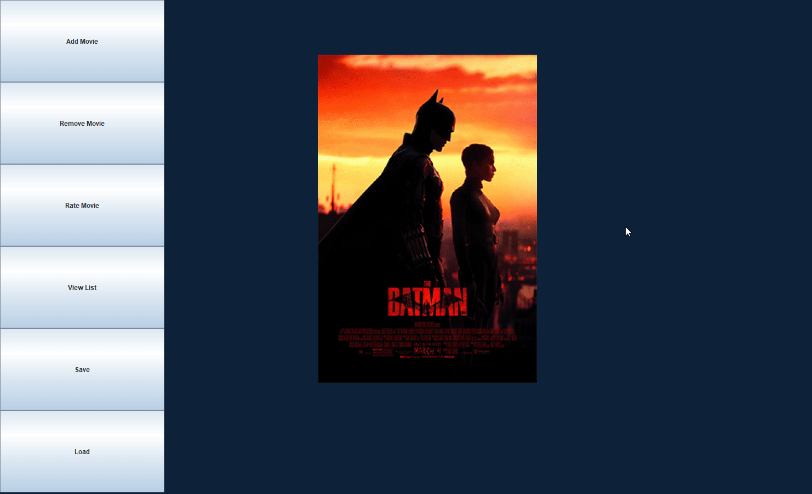

# Movie List Application

## What will the application do?
- The application allows the user to choose between a to-watch movie list or a watched movie list. After selecting a list, the user can add an arbitrary number of movies to the list, remove the added movies, view the list, rate the movies, and the app also tells the user which movie has the highest approval rating on the list.
  
## Who will use it?
- Any user who loves watching movies!

## Why is this project of interest to you?
- This project is of interest to me because I enjoy watching movies, and it is often hard to keep track in my head which movies I haven't seen and which ones I have. So designing this movie list app allows me to group them into different lists while keeping track of their approval ratings from Rotten Tomatoes and my own user ratings as well.

## User Stories:

- As a user, I want to be able to add a movie to my movie list
- As a user, I want to be able to view the movies on my movie list
- As a user, I want to be able to remove a movie from my movie list
- As a user, I want to be able to rate a movie on a scale of one to five
- As a user, I want to be able to see which movie has the highest approval rating on the list
- As a user, I want to be able to save my movie lists to file
- As a user, I want to be able to load my movie lists from file

The Teller app is used as a reference for this project
https://github.students.cs.ubc.ca/CPSC210/TellerApp
The JsonSerializationDemo app is used as a reference for this project
https://github.students.cs.ubc.ca/CPSC210/JsonSerializationDemo
The ListDemo app is used as a reference for this project
https://docs.oracle.com/javase/tutorial/displayCode.html?code=https://docs.oracle.com/javase/tutorial/uiswing/examples/components/ListDemoProject/src/components/ListDemo.java

Phase 4: Task 2
- Wed Mar 30 16:33:34 PDT 2022
- Movie added to movie list
- Wed Mar 30 16:36:35 PDT 2022
- Movie added to movie list
- Wed Mar 30 16:37:50 PDT 2022
- Movie added to movie list
- Wed Mar 30 16:38:37 PDT 2022
- Movie removed from movie list

Phase 4 :Task3
- The first refactoring that I would do to improve my design is that I would make both of my addMovie and removeMovie methods in the MovieList class to return void instead of boolean, and to just throw an error instead. This way I would not need to do extra if statements, and I could just use try-catch to handle the exceptions.
- Another refactoring I would do is to make my data persistence cleaner by restructure the MovieList class so that I can store all movies in one arraylist in a Json file, instead of storing each list of movies in a separate Json file. I would also implement a new method called getListActual to view the movies as a specific list and just store all the lists in one list, so in the future if I add in more lists I do not need to save in more Json files.
- The last refactoring I would do is to make AddMovie class extend MyFrame so that a lot of the same methods could be inherited instead of writing them twice in two different classes, and I would probably also split up removing movie responsibility from the AddMovie class, so I can adhere to the one responsibility principle. 

